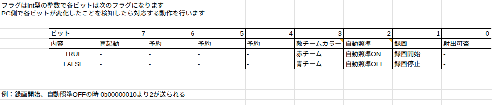

# core-attacker_control_mimic

## 動作概要
MA-KINGのアタッカーのメインボードの動作を再現します。

- UARTでの文字列送信
- 赤・青・黄のプッシュスイッチで送信する文字列を変更可能

## 使用方法

PCとUSBケーブルで接続し、`/dev/ttyACM*`などのデバイスファイルとして認識されると思うので、任意の方法で読み取る。

外部電源は不要でUSB給電のみでOK。

### 送信文字列

送信する文字列内のフィールドは以下の通り。

それぞれ1Byte(8bit)ずつ。

| 項目                | 説明                    |
| ----------------- | --------------------- |
| `state_id`        | 固定値: `2`              |
| `pitch_deg`       | 仰角: `120` (12.0°)     |
| `muzzle_velocity` | 弾速: `154` (15.4 m/s)  |
| `left_disks_num`  | 左ディスク数（仮）: `53`       |
| `right_disks_num` | 右ディスク数（仮）: `25`       |
| `video_id`        | カメラID（青ボタンで変更）: `0〜2` |
| `flags`           | 各種ビットフラグ: 下記参照        |
| `reserved`        | 予約: `0` 固定            |

`flags`は複数のフラグを扱うビット列で、対応は以下の通り。



### プッシュスイッチ

#### 青

操縦者の画面に表示するカメラのIDを変更する。

押すたびに`flags`の`video_id`を 0 -> 1 -> 2 -> 0 -> ... と変更

#### 黄色

録画機能のON/OFFを切り替える。

押すたびに`flags`の`record_flag` を 0 と 1 でトグルする。0 で録画停止。1 で録画開始。

#### 赤

ダメージパネルの認識対象のチームカラーを変更する。

押すたびに`team_collr`を 0 と 1 でトグルする。0 で青色パネルを認識。1 で赤色パネルを認識。言い方がややこしいので、認識対象の色とするのではなく、自チームの色と定義したほうがいいかもしれない。

## 動作環境

動作を確認した環境

- Ubuntu 22.04 + VSCode
- Ubuntu 24.04 + VSCode

依存モジュールは忘れた。`gcc-arm-none-eabi`とか`CMake`は必要。


### ST-LinkでNucleoF4ボードに書き込む
- ビルドターゲット`BUILD_ONLY`でビルド（`.bin`及び`.hex`を生成する）のみを行う
- ビルドターゲット`BUILD_AND_WRITE`でビルドし、これをマイコンに対して書き込みを行う

### VScodeでの実行エラーについて
例えば、VScodeで実行すると以下のようなエラーが出るが、これはVScode自体の設定によるものなので書き込みは出来る（ただし、実行の必要性は無い）。

```bash:実行エラー
bash: /home/<NucleoF4のプロジェクト>/build/NucleoF4_For_VScode.elf: バイナリファイルを実行できません: 実行形式エラー
``````

<br>

VScodeでの拡張機能`CMake Tools`をインストールして使用した場合
- VScodeではターゲット（`BUILD_ONLY`,`BUILD_AND_WRITE`）を選択して`Build`ボタンで完結する
- VScodeの例では実行ボタンは必要ない
